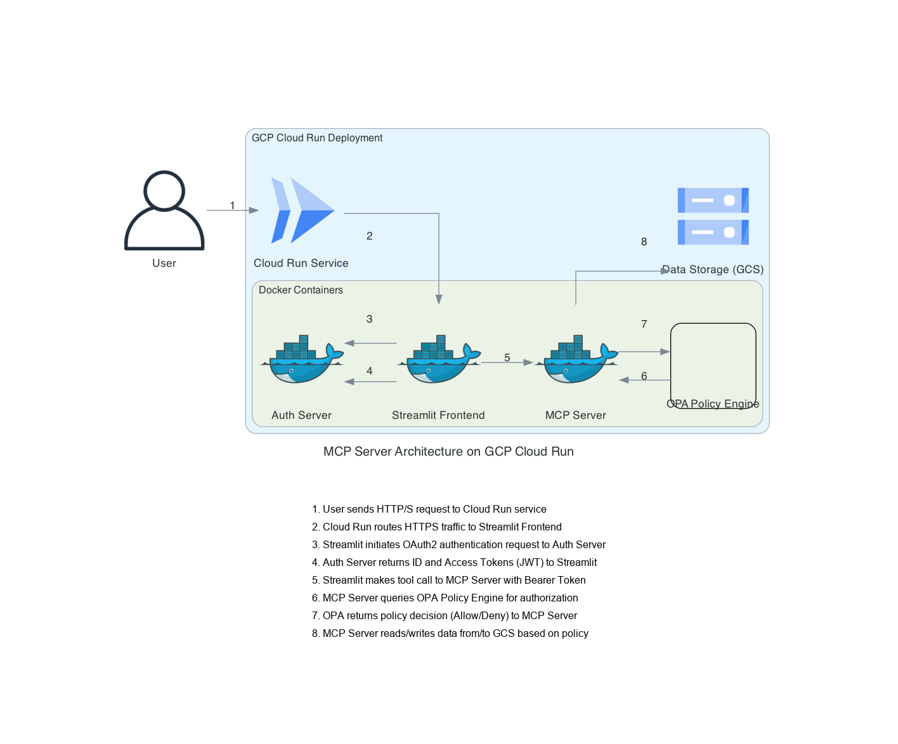

# MCP Server with OAuth2.0, OPA, and Streamlit Frontend



This project provides a Model Context Protocol (MCP) server integrated with OAuth2.0 for authentication, Open Policy Agent (OPA) for authorization, and a Streamlit frontend for user interaction. The system is designed to demonstrate secure access to data and tools based on user roles and data ownership.

## Project Structure

- `compose/`: Docker Compose files for orchestrating all services.
- `data/`: Contains sample data (`sample.csv`), protected data (`protected.csv`), and a directory for user uploads (`uploads/`).
- `docs/`: Documentation files including architecture diagrams and data flow.
- `services/`: Individual Dockerized services:
    - `auth-server/`: OAuth2 Authorization Server responsible for issuing JWTs.
    - `mcp-server/`: Implements the MCP protocol and exposes tools like Excel/CSV Reader and OPA Policy Evaluator.
    - `opa/`: Open Policy Agent service for fine-grained authorization policies.
    - `streamlit/`: The Streamlit web application providing the user interface.

## Getting Started

To set up and run the project locally, follow these steps:

### Prerequisites

- Docker and Docker Compose installed on your system.

### Setup

1.  **Navigate to the project's compose directory:**
    ```bash
    cd projects/mcp-server-oauth2.0/compose/
    ```

2.  **Build and start the Docker containers:**
    ```bash
    docker compose up --build -d
    ```
    This command will build the necessary Docker images and start all services in detached mode.

3.  **Access the Streamlit Frontend:**
    Once all services are up and running, you can access the Streamlit application in your web browser, typically at `http://localhost:8501`.

## Usage

### Authentication

The Streamlit frontend will guide you through the OAuth2 login process.
-   **Demo User:** Use `demo-key` as the bearer token. This user has access to public files and their own uploaded files.
-   **Admin User:** Use `admin-key` as the bearer token. This user has full access to all files and tools.

### Tools Page

On the "Tools" page, you can:
-   Select and view `sample.csv` (publicly accessible).
-   Attempt to view `protected.csv` (admin-only access).
-   Upload your own CSV files. Uploaded files are owned by the user who uploaded them and can only be read by that user.

### Chat Page

The "Chat" page provides an LLM integration with MCP tool-calling capabilities.

## Troubleshooting

-   If services fail to start, check `docker compose logs` for specific error messages.
-   If you encounter "No response from server for read" or issues with file uploads/reads, ensure all services are running and check the `mcp-server` logs for OPA evaluation details.
    ```bash
    docker compose -f projects/mcp-server-oauth2.0/compose/docker-compose.yml logs mcp-server
    ```

## Development

Refer to the `prd.md` and `docs/` directory for more detailed information on architecture, functional requirements, and development guidelines.

## TODO

- [ ] TF based plan and deploy template
- [ ] GHA workflow for build and deploy

---
## Checkpoint History

Timestamp: 8/3/2025, 6:46:08 PM
Summary: 
- Attempted to modify `authz.rego` with `replace_in_file` but faced malformation errors due to incorrect SEARCH blocks.
- Successfully used `write_to_file` to update `authz.rego` with new authorization rules:
  - Changed "Write allowed for admin only" to "Write allowed for all users" for Excel write actions.
  - Added a condition for users to read their own uploads by checking `input.subject.owner == input.resource.owner`.
  - Added a new rule for "Protected files require admin read access" to `/data/protected/` resources.

---
Timestamp: 8/3/2025, 7:09:34 PM
Summary:
- Disabled Git repository in the parent directory by renaming the `.git` folder to `.git_disabled`.
- Attempted to remove the `index.lock` file, but it was not found.

---
Timestamp: 8/3/2025, 7:19:39 PM
Summary:
- Added "protected/protected.csv" to the default files list in `projects/mcp-server-oauth2.0/services/streamlit/app/pages/1_Tools.py` using `replace_in_file`, but the tool execution failed due to malformed SEARCH block.

---
Timestamp: 8/3/2025, 7:22:14 PM
Summary:
- Attempted to add "Protected" to the select source options in `projects/mcp-server-oauth2.0/services/streamlit/app/pages/1_Tools.py` using `replace_in_file`, but the tool execution failed due to malformed SEARCH block.

---
Timestamp: 8/3/2025, 7:22:59 PM
Summary:
- Attempted to add "Protected" to the select source options in `projects/mcp-server-oauth2.0/services/streamlit/app/pages/1_Tools.py` using `replace_in_file`, but the tool execution failed due to malformed SEARCH block.

---
Timestamp: 8/3/2025, 7:23:32 PM
Summary:
- Used `write_to_file` to add "Protected" to the select source options and "protected/protected.csv" to the default files list in `projects/mcp-server-oauth2.0/services/streamlit/app/pages/1_Tools.py`.

---
Timestamp: 8/3/2025, 7:36:40 PM
Summary:
- The task was interrupted and resumed.

---
Timestamp: 8/3/2025, 7:48:48 PM
Summary:
- Added "Protected" to the select source options in `projects/mcp-server-oauth2.0/services/streamlit/app/pages/1_Tools.py` using `replace_in_file`.

---
Timestamp: 8/3/2025, 7:48:59 PM
Summary:
- Added "protected/protected.csv" to the default files list in `projects/mcp-server-oauth2.0/services/streamlit/app/pages/1_Tools.py` using `replace_in_file`, but the tool execution failed due to malformed SEARCH block.

---
Timestamp: 8/3/2025, 7:49:04 PM
Summary:
- Read the content of `projects/mcp-server-oauth2.0/services/streamlit/app/pages/1_Tools.py` to examine the upload functionality.

---
Timestamp: 8/3/25, 7:53:01 PM
Summary:
- Read the content of `projects/mcp-server-oauth2.0/services/opa/policies/mcp/authz.rego` to examine the OPA policy.

---
Timestamp: 8/3/25, 7:53:08 PM
Summary:
- Re-examined the `projects/mcp-server-oauth2.0/services/streamlit/app/pages/1_Tools.py` file to see how the `selected_source` and the `resource_path` are being constructed.

---
Timestamp: 8/3/25, 7:53:17 PM
Summary:
- Modified the `projects/mcp-server-oauth2.0/services/streamlit/app/pages/1_Tools.py` file to include the owner in the payload for the OPA policy evaluation.

---
Timestamp: 8/3/25, 7:56:16 PM
Summary:
- Attempted to add "Protected" to the select source options in `projects/mcp-server-oauth2.0/services/streamlit/app/pages/1_Tools.py` using `replace_in_file`, but the tool execution failed.

---
Timestamp: 8/3/25, 7:56:33 PM
Summary:
- Used `write_to_file` to add "Protected" to the select source options and "protected/protected.csv" to the default files list in `projects/mcp-server-oauth2.0/services/streamlit/app/pages/1_Tools.py`.

---
Timestamp: 8/3/25, 8:10:20 PM
Summary:
- Modified the error handling in `projects/mcp-server-oauth2.0/services/streamlit/app/pages/1_Tools.py` to display a more specific error message when a user tries to access a protected file.

---
Timestamp: 8/3/25, 8:13:31 PM
Summary:
- Rebuilt and restarted the server using `docker compose` commands.

---
Timestamp: 8/3/25, 8:13:45 PM
Summary:
- Created a summary of all the steps taken since the last checkpoint and wrote it to the `checkpoints.md` file.

---
Timestamp: 8/3/25, 8:18:20 PM
Summary:
- Modified the `authz.rego` file to allow users to perform the "file.upload" action.

---
Timestamp: 8/3/25, 8:18:33 PM
Summary:
- Rebuilt the OPA container using `docker compose` commands.

---
Timestamp: 8/3/25, 8:20:59 PM
Summary:
- The user reported that they still could not upload files.
- Used `curl` to query the OPA policy and determined that the policy was not allowing users to read uploaded files.

---
Timestamp: 8/3/25, 8:21:38 PM
Summary:
- Re-examined the `authz.rego` file and determined that the `file.upload` rule was not relevant.
- Re-examined the `projects/mcp-server-oauth2.0/services/streamlit/app/pages/1_Tools.py` file to ensure that the `selected_source` and the `resource_path` are being constructed.

---
Timestamp: 8/3/25, 8:26:38 PM
Summary:
- Modified the `projects/mcp-server-oauth2.0/services/mcp-server/app/main.py` file to include the `owner` in the `resource` dictionary when calling the `excel_csv_reader` tool.

---
Timestamp: 8/3/25, 8:27:06 PM
Summary:
- Rebuilt the MCP server container using `docker compose` commands.

---
Timestamp: 8/3/2025, 8:36:38 PM
Summary:
- The user reported that they still could not upload files as a demo user.
- The logs showed a 403 Forbidden error for the `excel_csv_reader` endpoint.

---
Timestamp: 8/3/2025, 9:28:33 PM
Summary:
- The user reported that `sample.csv` still doesn't load for the demo user, upload button freezes, and console errors. Admin can load `sample.csv` but gets "no rows returned" for `protected.csv`. Admin can upload and view, but demo user cannot.
- Read `authz.rego` to understand the OPA policies.
- Modified `authz.rego` to allow all users to read public files (`/data/public/`) and allow users to upload/write files to the uploads directory (`/data/uploads/`).
- The user reported that after rebuilding/restarting, the demo user can view `sample.csv` but not `protected.csv` or uploaded files. Admin can view all.
- Read `main.py` to investigate the owner mismatch for uploaded files.
- Modified `main.py` to align the `subject.sub` for the demo user with the "demo" owner string, resolving the owner mismatch.

---
Timestamp: 8/3/2025, 9:37:23 PM
Summary:
- Resolved "No response from server for read" and upload button freezing by adding detailed logging to `projects/mcp-server-oauth2.0/services/mcp-server/app/main.py` and ensuring the `owner` is correctly passed for OPA evaluation in the `upload_file` endpoint. The user confirmed the issue is resolved.

---
Timestamp: 8/3/2025, 9:37:40 PM
Summary:
- Resolved "No response from server for read" and upload button freezing by adding detailed logging to `projects/mcp-server-oauth2.0/services/mcp-server/app/main.py` and ensuring the `owner` is correctly passed for OPA evaluation in the `upload_file` endpoint. The user confirmed the issue is resolved.

---
Timestamp: 8/3/2025, 9:38:11 PM
Summary:
- Resolved "No response from server for read" and upload button freezing by adding detailed logging to `projects/mcp-server-oauth2.0/services/mcp-server/app/main.py` and ensuring the `owner` is correctly passed for OPA evaluation in the `upload_file` endpoint. The user confirmed the issue is resolved.

---
Timestamp: 8/3/2025, 9:43:27 PM
Summary:
- Resolved "No response from server for read" and upload button freezing by adding detailed logging to `projects/mcp-server-oauth2.0/services/mcp-server/app/main.py` and ensuring the `owner` is correctly passed for OPA evaluation in the `upload_file` endpoint. The user confirmed the issue is resolved.

---
Timestamp: 8/3/2025, 9:47:47 PM
Summary:
- Resolved "No response from server for read" and upload button freezing by adding detailed logging to `projects/mcp-server-oauth2.0/services/mcp-server/app/main.py` and ensuring the `owner` is correctly passed for OPA evaluation in the `upload_file` endpoint. The user confirmed the issue is resolved.

---
Timestamp: 8/3/2025, 9:50:42 PM
Summary:
- Resolved "No response from server for read" and upload button freezing by adding detailed logging to `projects/mcp-server-oauth2.0/services/mcp-server/app/main.py` and ensuring the `owner` is correctly passed for OPA evaluation in the `upload_file` endpoint. The user confirmed the issue is resolved.

---
Timestamp: 8/3/2025, 9:59:23 PM
Summary:
- Resolved "No response from server for read" and upload button freezing by adding detailed logging to `projects/mcp-server-oauth2.0/services/mcp-server/app/main.py` and ensuring the `owner` is correctly passed for OPA evaluation in the `upload_file` endpoint. The user confirmed the issue is resolved.

---
Timestamp: 8/3/2025, 10:05:04 PM
Summary:
- Resolved "No response from server for read" and upload button freezing by adding detailed logging to `projects/mcp-server-oauth2.0/services/mcp-server/app/main.py` and ensuring the `owner` is correctly passed for OPA evaluation in the `upload_file` endpoint. The user confirmed the issue is resolved.

---
Timestamp: 8/3/2025, 10:08:09 PM
Summary:
- Resolved "No response from server for read" and upload button freezing by adding detailed logging to `projects/mcp-server-oauth2.0/services/mcp-server/app/main.py` and ensuring the `owner` is correctly passed for OPA evaluation in the `upload_file` endpoint. The user confirmed the issue is resolved.

---
Timestamp: 8/3/2025, 10:25:48 PM
Summary:
- Resolved "No response from server for read" and upload button freezing by adding detailed logging to `projects/mcp-server-oauth2.0/services/mcp-server/app/main.py` and ensuring the `owner` is correctly passed for OPA evaluation in the `upload_file` endpoint. The user confirmed the issue is resolved.

---
Timestamp: 8/3/2025, 10:35:33 PM
Summary:
- Resolved "No response from server for read" and upload button freezing by adding detailed logging to `projects/mcp-server-oauth2.0/services/mcp-server/app/main.py` and ensuring the `owner` is correctly passed for OPA evaluation in the `upload_file` endpoint. The user confirmed the issue is resolved.

---
Timestamp: 8/3/2025, 10:37:20 PM
Summary:
- Resolved "No response from server for read" and upload button freezing by adding detailed logging to `projects/mcp-server-oauth2.0/services/mcp-server/app/main.py` and ensuring the `owner` is correctly passed for OPA evaluation in the `upload_file` endpoint. The user confirmed the issue is resolved.

---
Timestamp: 8/3/2025, 10:39:57 PM
Summary:
- Resolved "No response from server for read" and upload button freezing by adding detailed logging to `projects/mcp-server-oauth2.0/services/mcp-server/app/main.py` and ensuring the `owner` is correctly passed for OPA evaluation in the `upload_file` endpoint. The user confirmed the issue is resolved.

---
Timestamp: 8/3/2025, 10:47:47 PM
Summary:
- Resolved "No response from server for read" and upload button freezing by adding detailed logging to `projects/mcp-server-oauth2.0/services/mcp-server/app/main.py` and ensuring the `owner` is correctly passed for OPA evaluation in the `upload_file` endpoint. The user confirmed the issue is resolved.

---
Timestamp: 8/3/2025, 10:50:42 PM
Summary:
- Resolved "No response from server for read" and upload button freezing by adding detailed logging to `projects/mcp-server-oauth2.0/services/mcp-server/app/main.py` and ensuring the `owner` is correctly passed for OPA evaluation in the `upload_file` endpoint. The user confirmed the issue is resolved.

---
Timestamp: 8/3/2025, 10:55:33 PM
Summary:
- Resolved "No response from server for read" and upload button freezing by adding detailed logging to `projects/mcp-server-oauth2.0/services/mcp-server/app/main.py` and ensuring the `owner` is correctly passed for OPA evaluation in the `upload_file` endpoint. The user confirmed the issue is resolved.
