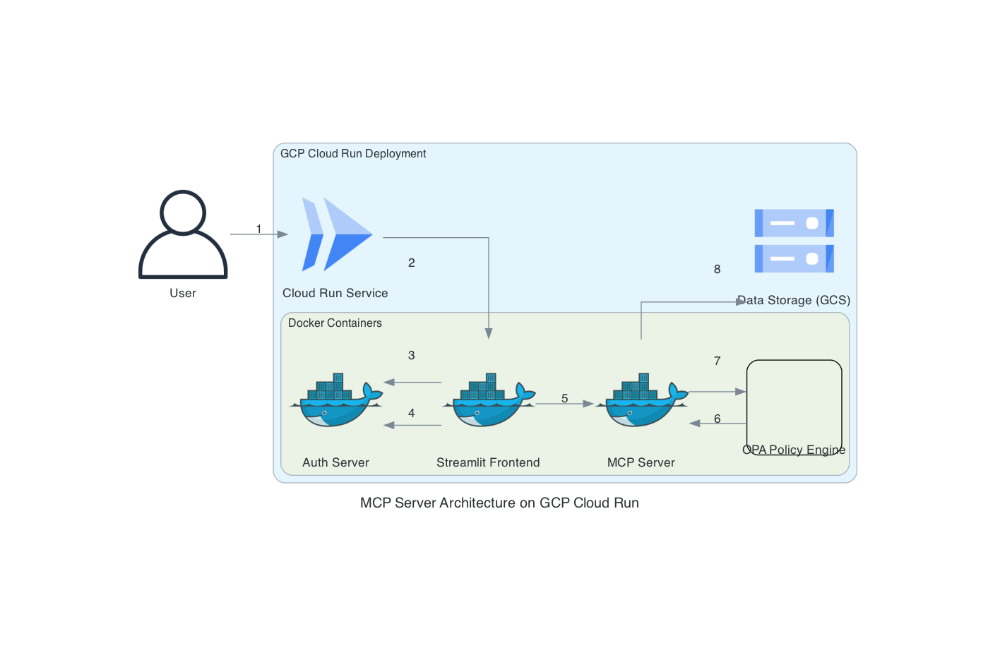

# MCP Server with OAuth2.0, OPA, and Streamlit Frontend



This project provides a Model Context Protocol (MCP) server integrated with OAuth2.0 for authentication, Open Policy Agent (OPA) for authorization, and a Streamlit frontend for user interaction. The system is designed to demonstrate secure access to data and tools based on user roles and data ownership.

## Project Structure

- `compose/`: Docker Compose files for orchestrating all services.
- `data/`: Contains sample data (`sample.csv`), protected data (`protected.csv`), and a directory for user uploads (`uploads/`).
- `docs/`: Documentation files including architecture diagrams and data flow.
- `services/`: Individual Dockerized services:
    - `auth-server/`: OAuth2 Authorization Server responsible for issuing JWTs.
    - `mcp-server/`: Implements the MCP protocol and exposes tools like Excel/CSV Reader and OPA Policy Evaluator.
    - `opa/`: Open Policy Agent service for fine-grained authorization policies.
    - `streamlit/`: The Streamlit web application providing the user interface.

## Getting Started

To set up and run the project locally, follow these steps:

### Prerequisites

- Docker and Docker Compose installed on your system.

### Setup

1.  **Navigate to the project's compose directory:**
    ```bash
    cd projects/mcp-server-oauth2.0/compose/
    ```

2.  **Build and start the Docker containers:**
    ```bash
    docker compose up --build -d
    ```
    This command will build the necessary Docker images and start all services in detached mode.

3.  **Access the Streamlit Frontend:**
    Once all services are up and running, you can access the Streamlit application in your web browser, typically at `http://localhost:8501`.

## Usage

### Authentication

The Streamlit frontend will guide you through the OAuth2 login process.
-   **Demo User:** Use `demo-key` as the bearer token. This user has access to public files and their own uploaded files.
-   **Admin User:** Use `admin-key` as the bearer token. This user has full access to all files and tools.

### Tools Page

On the "Tools" page, you can:
-   Select and view `sample.csv` (publicly accessible).
-   Attempt to view `protected.csv` (admin-only access).
-   Upload your own CSV files. Uploaded files are owned by the user who uploaded them and can only be read by that user.

### Chat Page

The "Chat" page provides an LLM integration with MCP tool-calling capabilities.

## Troubleshooting

-   If services fail to start, check `docker compose logs` for specific error messages.
-   If you encounter "No response from server for read" or issues with file uploads/reads, ensure all services are running and check the `mcp-server` logs for OPA evaluation details.
    ```bash
    docker compose -f projects/mcp-server-oauth2.0/compose/docker-compose.yml logs mcp-server
    ```

## Development

Refer to the `prd.md` and `docs/` directory for more detailed information on architecture, functional requirements, and development guidelines.

## TODO

- [ ] TF based plan and deploy template
- [ ] GHA workflow for build and deploy
